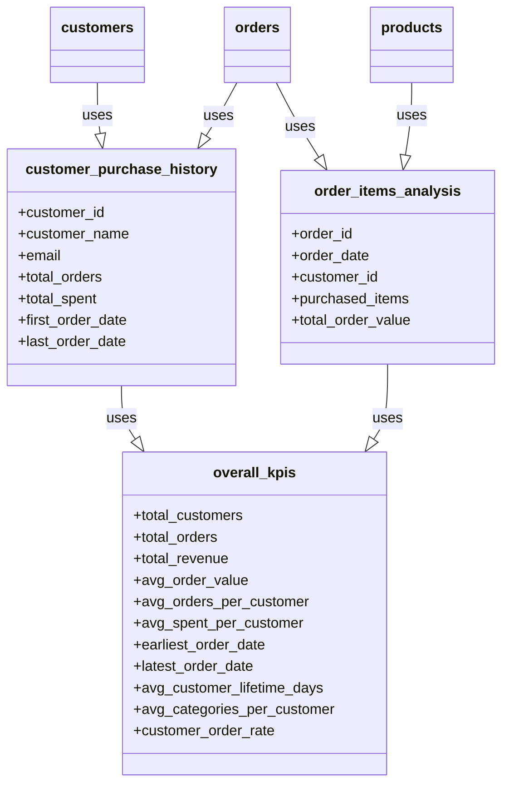

# StarBake

**StarBake** is a fictional bakery, and this project is its data pipeline: raw
operational files in, business insight out. It exists to be read and run — every
Starlake concept it uses is small enough to hold in your head, and the whole thing
runs on DuckDB with no account to create and nothing to configure.

## What this project ships

Three sources are loaded into the `starbake` domain:

| Table | Arrives as | Pattern | Write strategy |
| --- | --- | --- | --- |
| `starbake.customers` | CSV (`DSV`) | `customers.*.csv` | `APPEND` |
| `starbake.orders` | JSON (`JSON_FLAT`) | `orders.*.json` | `APPEND` |
| `starbake.products` | JSON (`JSON_FLAT`) | `products.*.json` | `APPEND` |

Three transformations read from them:

| Task | Produces |
| --- | --- |
| `starbake_analytics.customer_purchase_history` | one row per customer: `total_orders`, `total_spent`, `first_order_date`, `last_order_date` |
| `starbake_analytics.order_items_analysis` | one row per order: `purchased_items`, `total_order_value` |
| `starbake_kpis.overall_kpis` | one row for the whole business: revenue, order and customer averages, lifetime and rate indicators |



Nothing declares that order: `overall_kpis` reads the two analytics tables in its
SQL, and Starlake works the dependency out from there. `--recursive` runs the
upstream tasks first.

## How to run it

The three sample files ship under `datasets/archive/starbake/`, and
`datasets/incoming/starbake/` holds only an empty `ack` marker — nothing there
matches the `pattern` any of the three tables declares — so the first step is to
copy them across.

```bash
export SL_ROOT=$PWD
starlake validate

cp datasets/archive/starbake/* datasets/incoming/starbake/

starlake load --domains starbake --tables customers --files "${SL_ROOT}/datasets/incoming/starbake/customers.csv"
starlake load --domains starbake --tables orders    --files "${SL_ROOT}/datasets/incoming/starbake/orders.json"
starlake load --domains starbake --tables products  --files "${SL_ROOT}/datasets/incoming/starbake/products.json"

starlake transform --name starbake_kpis.overall_kpis --recursive
```

The CLI is **silent on success**: exit code 0 with no output means it worked, not
that it did nothing. Prefix any command with `SL_LOG_LEVEL=info` to see the SQL it
ran, the write strategy it applied and the audit rows it inserted. What actually
happened is in the `audit.audit`, `audit.rejected` and `audit.expectations`
tables, in the same `datasets/duckdb.db` as your data.

Switch engine with `SL_ENV`, which selects `metadata/env.<NAME>.sl.yml`:
`BQ` (BigQuery), `PG` (PostgreSQL), `SNOW` (Snowflake), `REDSHIFT`. Unset means
the base `env.sl.yml`, which is DuckDB.

## Where to take it next

The bakery scenario is deliberately larger than what ships here, and the gap is
the exercise. Suppliers, Ingredients and ProductIngredients are part of the story
but **have no table in this project**; neither do the analytics it would make
possible — product profitability needs ingredient costs, and a lifetime-value or
top-selling-products table needs nothing that is not already loaded.

Good next steps, roughly in order of effort:

1. add an expectation to `starbake.customers` — the macros you can call are the
   `.j2` files in `metadata/expectations/`;
2. give `customers` a real write strategy: `APPEND` duplicates rows when you
   reload the same file, `UPSERT_BY_KEY` does not;
3. add a fourth source (ingredients, suppliers) with
   `starlake infer-schema`, and a transform that uses it;
4. generate the orchestration — `starlake dag-generate` — and look at what
   `metadata/dags/` gave you.

## Working with an AI assistant

`AGENTS.md` is the contract your assistant reads: what this project contains,
where to look each thing up, and the rules it must follow — read the project
rather than assume it, never invent a YAML key or a macro name, run
`starlake validate` instead of predicting it. `CLAUDE.md`, `GEMINI.md` and
`.github/copilot-instructions.md` point at it, each in the file its own assistant
loads. Keep them in step with the project as it grows.

## Where to go next

- [starlake.ai](https://starlake.ai) — product site and documentation
- `starlake --help`, and `starlake <command> --help` for any command
